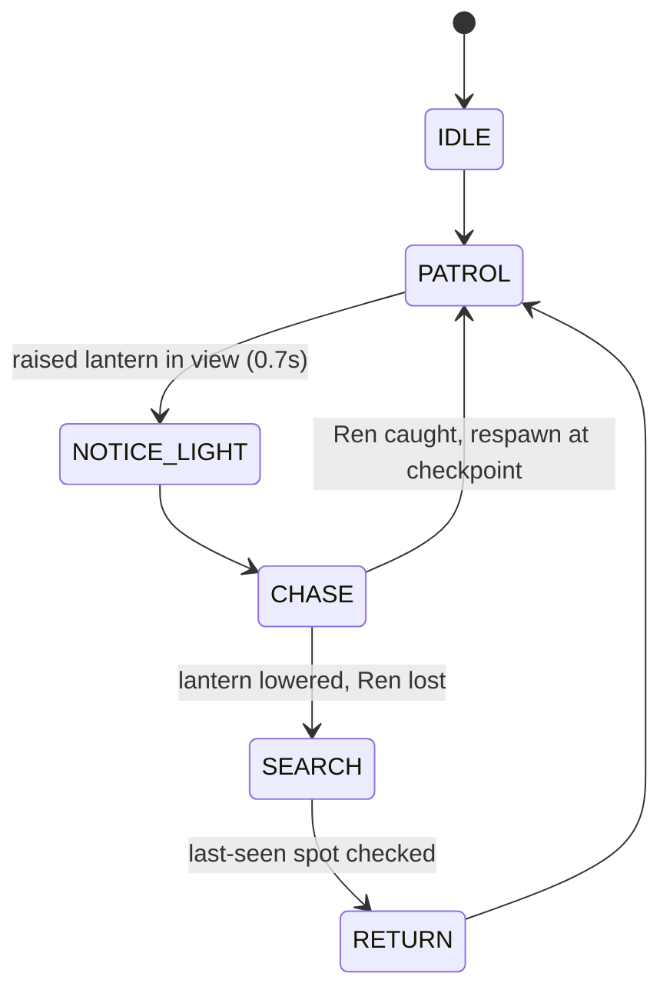

I'd been carrying a game idea around for months with no good excuse to start it. Then Claude Community Events put on a Fable 5.1 Build Day at Roamwork Harrington in District Six on 12 September, with API credits from Anthropic and one 90-minute build window. Bring a laptop and an idea, they said. Pick a track: Delight, Breakthrough, or Everyday. Demo in two minutes at 12:15. That's a deadline, and I work well with those.

The idea is 灯 TOMOSHI, The Last Lantern. Ren, a wandering shrine keeper, carries the last burning lantern up an abandoned mountain. The yōkai there aren't monsters. They're memories of villagers who never found the road home. The whole game is one mechanic you cycle endlessly: raise the lantern and it reveals hidden platforms, spirit footprints and old writing, but the faceless Watchers can see your flame. Lower it and you're only wind to them, while some paths vanish and others made of still water and spirit stone appear. Delight track, obviously.

I didn't open the editor first. I wrote a one-page brief: the concept, a seven-colour palette (ink black, indigo night, temple red, lantern gold, rice paper, moss, spirit blue), the controls, the stack (TypeScript, Phaser 3, Vite), and a hard scope of one vertical slice. Then Claude and I built in checkpoints, and each one had to be playable before the next started. Movement and camera. The lantern. The Watcher. The memory echo. The fox quest. Polish. The brief paid for itself inside the first hour. I never had to re-explain the tone mid-session, and when I got tempted to add a second enemy type I could point at the scope line and say no.

It didn't stay a slice. By the end of the day:

- Three chapters with a full arc: the fox and the bell in the village, the weaver and her husband's straw hat on the flooded terraces, the keeper and the first flame at the temple, and the reveal that the keeper's apprentice was Ren.
- Levels are pure data. A chapter is a map, signs, zones, echo keyframes, dialogue, spirit and item textures, Watcher tuning, and what comes next. Adding a chapter means adding an entry.
- A title screen, chapter intro cards, an Esc pause overlay with the objective and controls, a persistent objective line, and progress saved to localStorage.
- No external assets at all. Sprites are drawn procedurally and every sound is synthesised with Web Audio: wind with gusts, rain by zone, shishi-odoshi bamboo knocks, the bell, footsteps, the Watcher's notice and lost cues. I still can't quite believe the bamboo knock sounds right.
- A test suite that plays the game. Headless Chrome drives all three chapters with real key input, every jump, every bridge timing against the Watcher patrols, every mid-air toggle, through the epilogue and back to the title, and asserts zero console errors.
- A slide deck on how it was built, with its own test that renders every slide and checks the diagrams draw.

The Watcher is a small state machine, and most of the level design turned out to be about timing your light around it:

The bugs are the part I'd talk about in an interview, because none of them were where I expected. UI text was aliased. The game rendered at 480 by 270 and the browser upscaled it with nearest-neighbour, which is exactly what you want for sprites and exactly what you don't want for a paragraph of dialogue. The fix was a 1440 by 810 canvas with the gameplay camera zoomed three times: sprites stay chunky, text gets rasterised at full resolution. This one annoyed me most: quick taps on F, E, Space and Shift were sometimes dropped. Phaser's JustDown clears its flag on key-up, so a press that went down and up inside a single frame never existed as far as the game was concerned. Single-press actions now latch from keydown events and get consumed once per frame. And after I added a world-bounds clamp, falling into a pit stopped killing Ren, because the bottom boundary sat exactly on the pit floor and Ren just stood on it.

The autopilot earned its keep here. It caught a landing-squash tween that kept un-grounding the player, an objective HUD that compared against its own formatted text and never showed, and a long jump that ran clean off the edge of the world. I wouldn't have found the HUD one by playing. It looked fine. It was just never there.

I'm not fully sold on the text fix, for what it's worth. A bitmap font would suit the woodblock look better and the linear filter is a compromise I'll probably revisit.

Some notes on Fable 5.1 itself, since that was the point of the day. What stood out was how little steering it needed once the brief existed. I'd say "the text is unreadable" and get back a diagnosis, not a font-size tweak: the canvas was 480 by 270 and the browser was upscaling everything, so the fix had to be the renderer. Same with the dropped taps. I reported that lowering the lantern on a bridge didn't drop Ren, expected a physics fix, and got an input fix instead, with a same-frame key test to prove it. Both times it went after the cause rather than the symptom, and both times it was right.

It also tests its own work without being asked, which I didn't expect. Every checkpoint came with a headless playthrough, and when I asked for menus and more chapters it extended the playthroughs to cover them before telling me it was done. Later in the day, fixing this site's www redirect, it caught its own bug. The first version sent the bare www root to a literal "/:path*" string, and it only found that by running the built Worker locally and hitting it with a Host header. I would have shipped that.

The friction was smaller stuff. It kept putting long dashes in everything and I had to say so twice. And the pit-death bug was its own doing: a world-bounds clamp it added for a different bug moved the floor, and I only found it because I was playing rather than reading. After that it added a respawn assertion so the suite would catch it next time, which is the pattern I've settled into with it. Let it move fast, play the build myself, and turn every bug I find into a test it has to keep passing.

Between sessions I also cleared this site's backlog: 40 open Dependabot alerts across Next.js, sharp, PostCSS and their dependencies, and a www host that was serving duplicate pages instead of redirecting, which had Google indexing two copies of everything. This is also the first note here written as a markdown file with photos uploaded from a browser, so if you're reading it, that pipeline works.

Next is pixel art, which means replacing every procedural texture, and I honestly don't know yet whether the print-like look I want survives at 16 pixels a tile. The code is public at github.com/Rashay01/TOMOSHI, MIT for the code with the story and art reserved, if you want to poke at it before I find out.
