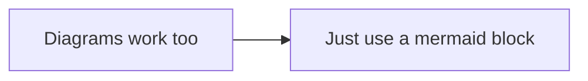

# Adding a note without touching code

Notes on rashaydaya.co.za/notes are plain markdown files in `content/notes/`.
Photos live under `public/notes/<slug>/`. You can do the whole thing from the
GitHub website or the GitHub mobile app, and the deploy to Cloudflare happens
automatically when the change reaches `main`.

## 1. Add the photos (optional)

1. On GitHub, open `public/notes/`.
2. **Add file then Create new file**, type `<your-slug>/.keep` as the name, commit. That creates the folder.
3. Open the new folder, **Add file then Upload files**, drop your images in, commit.
   Use `.webp` or `.jpg`, keep each one under about 300 KB, and name them
   lowercase-with-dashes. Landscape 16:9 looks best; the page shows them at that ratio.

## 2. Write the note

1. Open `content/notes/`, **Add file then Create new file**.
2. Name it `<your-slug>.md`. The file name becomes the URL, so
   `cape-town-meetup.md` is published at `/notes/cape-town-meetup`.
   Lowercase letters, numbers and dashes only.
3. Paste this and fill it in:

```markdown
---
title: Title shown on the page and in search results
summary: One sentence shown in the notes list and under the title.
publishedAt: 2026-09-12
---

First paragraph. Blank lines separate paragraphs; single line breaks are joined.

- Bullet points are one per line, starting with "- "
- Keep them short



```

Frontmatter fields:

| Field | Required | Notes |
|---|---|---|
| `title` | yes | |
| `summary` | yes | One sentence |
| `publishedAt` | yes | `YYYY-MM-DD`. Newest notes list first |
| `status` | no | `Published` (default) or `Planned` |
| `relatedCaseStudy` | no | A slug from `src/lib/data/case-studies.ts` to link "Built on this" |

## 3. Commit to a branch and open a pull request

Choose **Create a new branch for this commit and start a pull request** when
you commit. CI runs lint, tests and the build on the PR. If the markdown has a
mistake (missing `publishedAt`, an image path that does not exist, a code
block that is not `mermaid`), the build fails with a message that names the
file and the problem. Fix it in the PR, then merge. The site deploys itself.

## What is supported

Paragraphs, bullet lists, images with optional captions, and Mermaid diagrams.
That is the full list on purpose: it is everything the page knows how to
render, so nothing can end up on the site looking wrong. Inline formatting
such as bold, links, and code spans is shown as typed.

## How it works

`scripts/build-notes.mjs` compiles the markdown into
`src/lib/data/notes.generated.json` before every `next build`, `next dev`, and
test run. The Worker on Cloudflare never reads files at runtime; everything is
resolved at build time. The parser lives in `scripts/notes/markdown.mjs` and
has tests in `src/lib/content/markdown.test.ts`.
